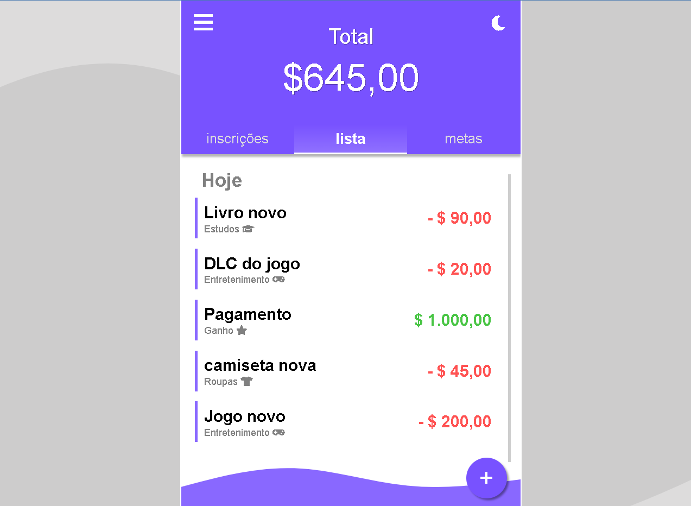
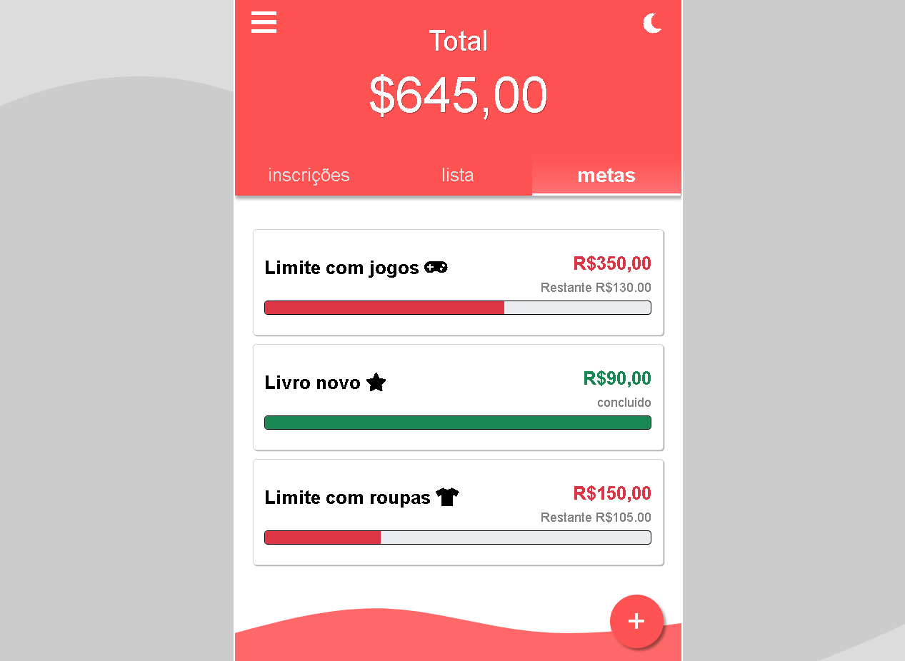
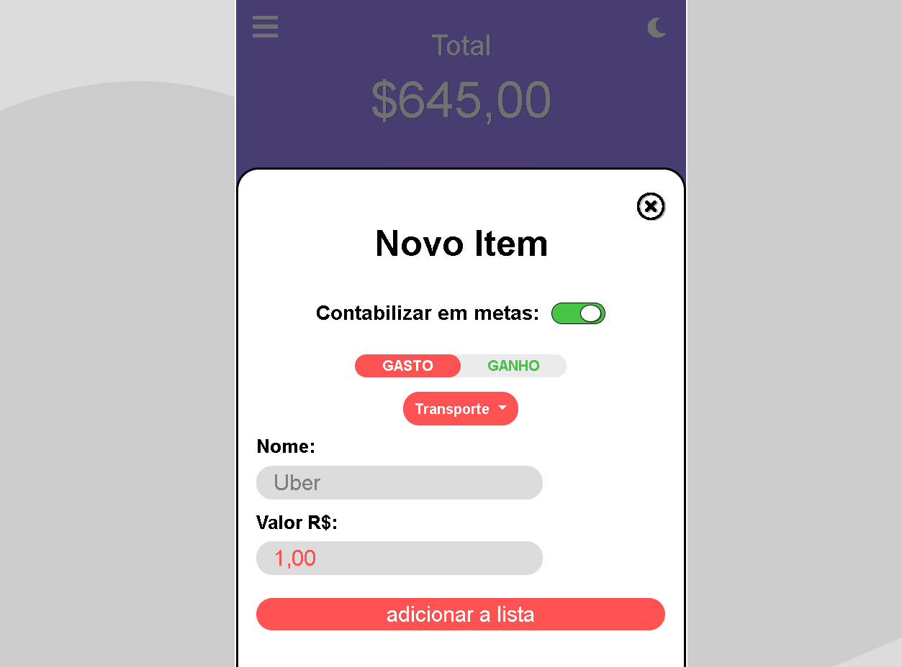
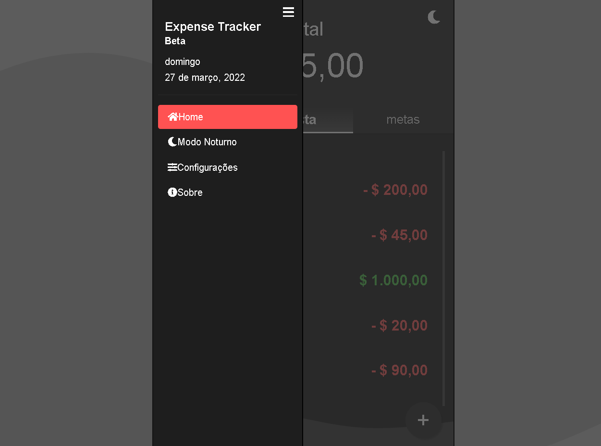

 <h1 align="center">
    
</h1>
<h1 align="center">
    
</h1>
<h1 align="center">
    
</h1>
<h1 align="center">
    
</h1>

# Expense Tracker

<a align="center" style="font-weight: bold" href="https://alcantara-diego.github.io/aplicativodegastos/" target="_Blank">👉Acesse meu projeto nesse link👈</a>

  

<h3>Tecnologias usadas no projeto</h3>
<ul>
<li>HTML5</li>
<li>CSS3</li>
<li>Javascript</li>
<li>Bootstrap</li>
<li>JQuery</li>
</ul>

  
# Descrição

Aplicativo de controle de finanças, feito com vanilla javascript.

<strong>Expense Tracker</strong> foi o primeiro projeto grande que pensei em fazer logo quando decidi levar programação mais a sério, antes eu só desenvolvia coisas simples, mas dessa vez tentei dar um passo a frente e criar algo mais completo, bonito estéticamente e cheio de funcionalidades, a ideia era criar um app que eu usaria mesmo se não fosse criado por mim.

Por eu ser bem iniciante com desenvolvimento front-end na época, tive muita dificuldade no processo, escrevi e apaguei funções que eu tinha criado diversas vezes por não funcionarem devidamente como eu queria.

levei mais de 3 meses trabalhando unicamente nesse projeto, fazendo muitas pesquisas no <strong>Stack Overflow</strong> para tirar minhas duvidas, aprender mais e criar a melhor aplicação possível, e acredito que atingi minhas expectativas.

Já desenvolvi alguns outros projetos depois do <strong>Expense Tracker</strong>, porém ele ainda está entre os meus favoritos pelo desafio que me trouxe, <strong>o aprendizado foi enorme!</strong>

# Aprendizados com o projeto:

<strong>StackOverflow e autodidatismo:</strong> Por muitas vezes me deparei com problemas em que eu não tinha conhecimento suficiente para chegar na solução, e isso me possibilitou aprender a aprender, aprendi a pesquisar minhas dúvidas e o uso do <strong>StackOverflow</strong> foi essencial nisso.

<strong>Manipulação do DOM:</strong> Aprendi a controlar o aparecimento de abas na tela com o uso do Javascript.

<strong>Bootstrap:</strong> Usei o Bootstrap pela primeira vez para facilitar o desenvolvimento, e aprendi a usar as classes e componentes. Todos os alertas do app são parte do Bootstrap.

<strong>JQuery:</strong> Também usei o JQuery pela primeira vez e facilitou muito a criação de funções.

<strong>Trabalhar com projetos maiores: </strong> O javascript do projeto contém mais de 1.000(mil) linhas, e para não se perder no meio de tudo aprendi a escrever um código melhor, dando melhores nomes a funções e variáveis para manter tudo organizado.

<strong>Comentar o código: </strong> Pelo tempo que levou para desenvolver o projeto, precisei voltar e alterar funções antigas diversas vezes, e o hábito de comentar o código ajudou muito a relembrar o que cada função fazia.

  

# Features do projeto:
 <strong>Memória salva:</strong> Os itens criados ficam salvos no <strong>localStorage</strong> do navegador.

<strong>Aba adicionar:</strong> A mesma div é usada para adicionar itens nas 3 abas do app <strong>(inscrições, lista e metas)</strong>, e o item será adicionado na aba que estiver selecionada no momento.

<strong>Histórico de transações:</strong> Todo item criado na lista fica registrado com o nome, data da transação, categoria e valor.

<strong>Metas:</strong> Com a criação de metas é possível escolher um limite para o máximo que pode ser gasto em uma determinada categoria e acompanhar o progresso, a barra é preenchida conforme é adicionado itens na lista principal da mesma categoria da meta.

<strong>Inscrições:</strong> Inscrições são pagamentos frequentes ou assinaturas, como Netflix e Spotify Premium, que podem ser adicionados a essa sessão para não se esquecer delas e ter uma noção do quanto é gasto com essas assinaturas.

<strong>Mudar cor do tema:</strong> Nas configurações, a cor principal do app pode ser personalizada, com 3 opções disponíveis.

<strong>Modo noturno:</strong> Modo noturno presente nas configurações do app.
 
   
 # Pré-requisitos:

 Nenhum pré-requisito necessário, apenas te convido a dar uma olhada :)

 
<a align="center" style="font-weight: bold" href="https://alcantara-diego.github.io/aplicativodegastos/" target="_Blank">👉Acesse meu projeto nesse link👈</a>

  

<strong>|Made with ❤️ by Diego Alcântara 👨🏽‍💻 <a align="center" style="font-weight: bold" href="https://www.linkedin.com/in/diego-alc%C3%A2ntara-790424235" target="_Blank">See my linkedIn</a></strong>

